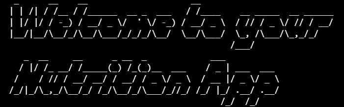
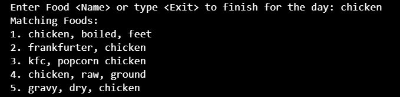

# NUTRITION APP
## Video Demo:  <URL HERE>

## Description
This app is designed to make users keep track of their macro nutrients and calories by storing information about the food they consume in a diary. The app will calculate the total intake of calories, protein, carbs and fats. Additionally users can generate a pdf report with all the food information provided, making easy to review and manage their diet.

## Features
1. **User Features:**
    - Food diary (pdf).
    - Personalised headers.
    - Macro nutrients calculation.

2. **Code Features:**
    - List of similar foods.
    - Data base(csv) more than **8.000** diferent aliments.
    - Stores the food diary for future use.

## Dependencies
1. **Python Standard Libraries:**
    - **sys:** for exiting the program.
    - **csv:** to acess the nutritional database.
    - **json:** for saving the food diary.
    - **datetime:** for add the day in which the report was created.
    - **os:** for checking the existense of files.
2. **Python External libraries**
    - **figlet:** to create a personalised ASCII art header.
    - **fuzzywuzy:** to display matching food names from user input.
    - **fpdf:** to create a pdf file.

## Code Walkthrough
1. **main():**
    - Print a welcome banner using pyfligletkdo
    - Then will load the food diary if exists.
    - Call the get_choice function to start the program.

2. **get_choice():**
    - Will give three choices to the user:
        - **"Diary"** add food to diary.
            - Print a banner showing the day the food diary is on.
            
            - Call get_food() and get_food_info()
            - if the users calls exit in get_food() will be exited in the get_choice()
        - **"Report"** generate a pdf with all the information.
        - **"Exit"** exit the program with sys.
    - Each of the choices will take the user to the variable with the appropriate usage.

3. **get_data_base():**
    - Reads the database file "nutrition.csv" and loads in a dictionary with food name as keys and the nutrional values as values.
    - The database brings the nutritionvalues ​​of:
        - **"calories"** as float
        - **"serving_size"** as float
        - **"protein"** as float
        - **"carbs"** as float
        - **"fats"** as float
    - If the nutritional values ​​are not in the database the values ​​will be returned as 0.
4. **get_food():**
    - Prompts user to input a food item
    - Uses fuzzywuzy to sugest a food macht:
     
     - Then prompts user to put the quantity in grams for the food selected

5. **get_food_info():**
    - Use the nutritional data and the quantity provided to calculates the macro nutrients
    - Store the result nutritional information in a dict(diary) for the specified day

6. **save_food_diary() load_food_diary():**
    - Save the food diary for future uses in a json file
    - Loads the json file if exists. If no file exists, it inicializes an empty diary

7. **show_report():**
    - Generate a pdf file with food diary content, summarizing the foods consumed each day, detailing the calories and macronutrients
    - Uses FPDF2 library

# Helpful documentation and links
- **Database:** https://www.kaggle.com/datasets/trolukovich/nutritional-values-for-common-foods-and-products?resource=download

- **Built-in types python:** https://docs.python.org/3/library/stdtypes.html#range

- **unittest.mock:** https://docs.python.org/3/library/unittest.mock.html

- **FPDF2 library:** https://py-pdf.github.io/fpdf2/Tutorial.html

- **Inflect library:** https://pypi.org/project/inflect/

- **Sys library:** https://docs.python.org/3/library/sys.html
